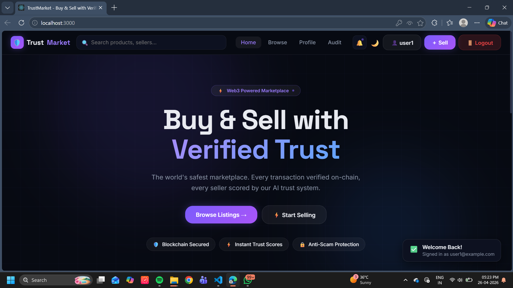
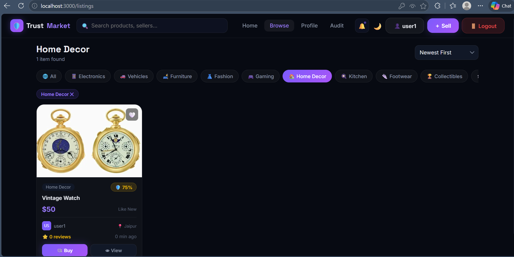
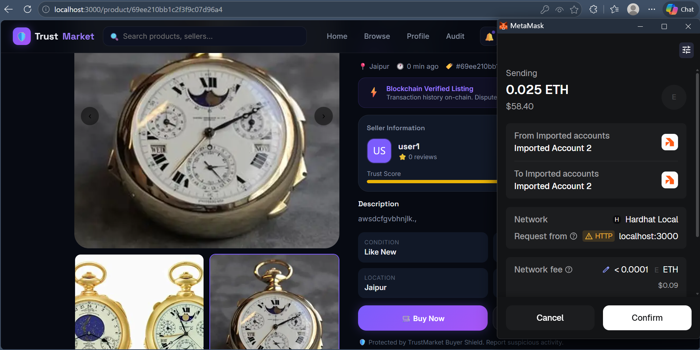
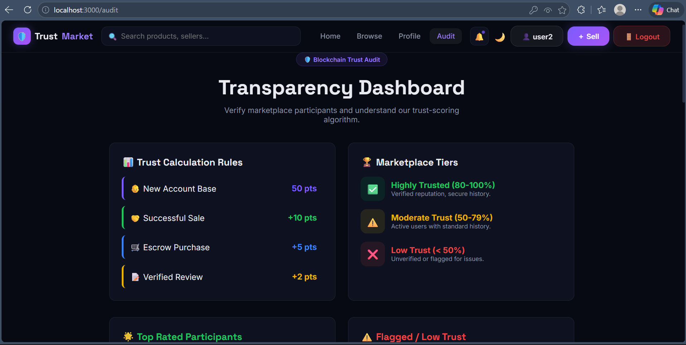
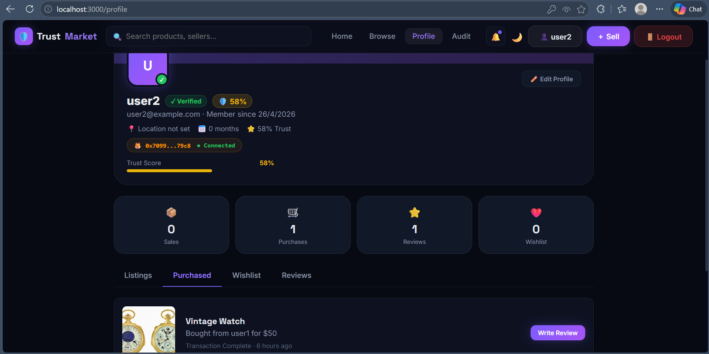
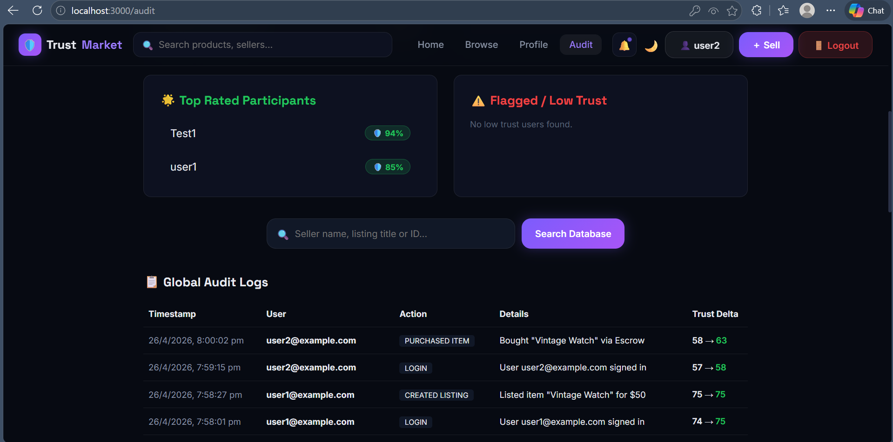

---

# 🚀 TrustMarket – Decentralized Marketplace (Web3 OLX)

A hybrid **Web2 + Web3 decentralized marketplace** where users can securely buy and sell items using blockchain-based escrow, MetaMask authentication, and a trust scoring system.

---

## 🌐 Live Concept

TrustMarket removes middlemen by combining:

* ⚡ Fast Web2 backend (Node + MongoDB)
* 🔐 Secure Web3 smart contracts (Solidity + Hardhat)
* 👛 Wallet-based identity (MetaMask)

---

## 🏗️ System Architecture


### 🧠 Overview

* MongoDB handles fast user + product data
* Node.js/Express manages APIs
* Smart contracts handle escrow & payments
* MetaMask ensures secure user authentication

---

## 🛠️ Tech Stack

### 💻 Frontend

* HTML
* CSS
* JavaScript (SPA)

### ⚙️ Backend

* Node.js
* Express.js

### 🗄️ Database

* MongoDB

### ⛓️ Blockchain

* Solidity
* Hardhat

### 🔗 Web3 Integration

* ethers.js
* MetaMask

---

## 🔄 System Workflow

1. User registers and connects MetaMask wallet
2. Seller creates product listing with signature verification
3. Buyer places order and pays via smart contract
4. Funds are locked in blockchain escrow
5. Seller ships product
6. Buyer confirms delivery
7. Smart contract releases payment to seller
8. Trust score updates based on behavior

---

## ⚙️ Prerequisites

Before running this project, ensure you have:

* Node.js (v16+ recommended)
* MongoDB running locally (`mongodb://localhost:27017`)
* MetaMask browser extension
* Hardhat environment setup

---

## ⛓️ Smart Contract Setup (Hardhat)

```bash
cd smart_contract
npx hardhat init
npx hardhat node
```

### 🧪 Output:

* Local blockchain starts
* 20 test accounts generated
* 10,000 test ETH per account

👉 Import account into MetaMask for testing

---

## 🖥️ Backend Setup

```bash
cd backend
npm install
node server.js
```

### ✅ Expected Output:

```
Server running on port 5000
MongoDB connected
```

---

## 🌐 Frontend Setup

```bash
npx serve .
```

Then open:

```
http://localhost:3000
```

---

## 📸 Screenshots (Project Demo)

### 🏠 Home Page



---

### 📦 Product Listings



---

### ✅ Product Listing Confirmation (MetaMask)


---

### 💰 Purchase via MetaMask



---

### ⭐ Trust Score System



---

### 👤 User Profile



---

### 📊 Audit Page



---

## 🧪 Feature Testing Guide

### 👤 Authentication

* Sign up / login
* Connect MetaMask wallet

---

### 📦 Sell Item

* Add product details
* Upload image
* Sign transaction via MetaMask

---

### 💰 Buy Item (Escrow System)

* Select product
* Confirm payment via smart contract
* Funds locked in escrow

---

### 🚚 Delivery Flow

* Seller ships product
* Buyer confirms delivery
* Smart contract releases funds

---

### ⭐ Trust Score System

* Ratings + reviews update automatically
* Reputation score changes dynamically

---

### 📊 Audit System

* Full transaction history available
* Transparent user activity logs

---

## 🎯 Key Features

* 🔐 Blockchain-based escrow system
* 👛 MetaMask authentication
* ⭐ Dynamic trust scoring system
* 📊 Transparent audit logs
* ⚡ Fast Web2 + secure Web3 hybrid architecture
* 🧾 Real-time transaction tracking

---

## 📌 Project Highlights

✔ Hybrid Web2 + Web3 architecture
✔ Real escrow smart contract system
✔ Real-world OLX-like use case
✔ Production-style folder structure
✔ Full transaction transparency

---

## 🚀 Future Improvements

* 🌐 Deploy smart contracts on Polygon / Ethereum mainnet
* 🗂️ Use IPFS for decentralized image storage
* ⚖️ Add dispute resolution system
* 📱 Convert frontend to React / Next.js
* 🔔 Add real-time notifications system

---
